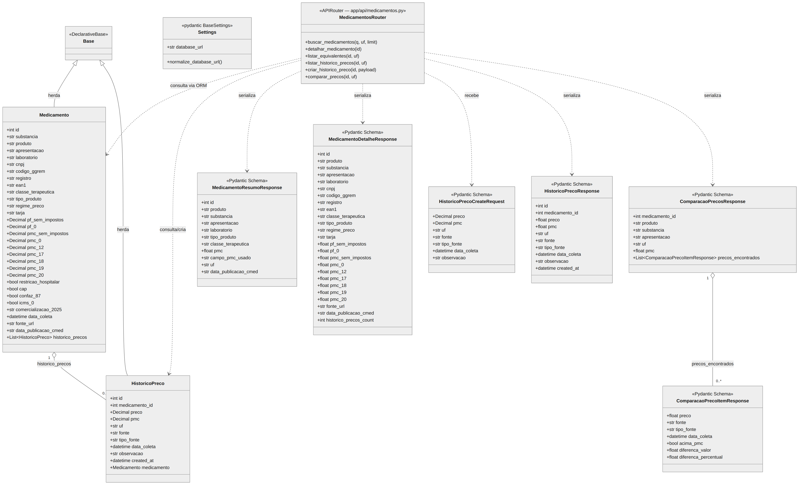

# PharmaPrice 💊

**Sistema web para comparação de preços de medicamentos com integração de dados regulatórios da CMED/ANVISA**

Trabalho de Conclusão de Curso II (TCC2) — Bacharelado em Sistemas de Informação
Instituto Federal de Educação, Ciência e Tecnologia do Sudeste de Minas Gerais — Campus Juiz de Fora (IFSEMG)

**Autor:** Bernardo Oliveira Duarte
**Orientador:** Prof. Emerson Augusto Priamo Moraes
**Ano:** 2026

---

## Sobre o projeto

O PharmaPrice é um sistema web responsivo que integra dados regulatórios da CMED (Câmara de Regulação do Mercado de Medicamentos/ANVISA) com preços de medicamentos, permitindo ao consumidor comparar o preço encontrado com o Preço Máximo ao Consumidor (PMC) definido pelo governo.

O principal diferencial do sistema é tornar visível o teto regulatório da CMED no momento da decisão de compra — algo que plataformas comerciais existentes como Consulta Remédios e CliqueFarma não fazem explicitamente.

Este repositório contém a **implementação do protótipo funcional** desenvolvida no TCC2. O modelo conceitual completo foi apresentado e aceito no XII Congresso Internacional em Tecnologia e Organização da Informação (TOI 2026).

---

## Stack tecnológica

| Camada          | Tecnologia                | Versão        |
| --------------- | ------------------------- | ------------- |
| Backend         | Python + FastAPI          | 3.12 / 0.115+ |
| Banco de dados  | PostgreSQL                | 16            |
| ORM             | SQLAlchemy + Alembic      | 2.x           |
| Frontend        | React + Vite + TypeScript | 18 / 5.x      |
| Visualização    | Recharts                  | —             |
| Testes          | pytest + pytest-cov       | —             |
| Containerização | Docker + Docker Compose   | —             |

---

## Estrutura do repositório

```
pharmaprice/
├── backend/
│   ├── app/
│   │   ├── api/            # Endpoints REST (busca, detalhe, histórico, comparação, equivalentes)
│   │   ├── core/           # Configurações e variáveis de ambiente
│   │   ├── db/             # Modelos SQLAlchemy, sessão e migrations Alembic
│   │   ├── cmed/           # Pipeline de importação da tabela CMED/ANVISA
│   │   └── scripts/        # Scripts auxiliares (seed de dados demonstrativos)
│   ├── alembic/            # Migrations do banco de dados
│   ├── tests/              # Testes automatizados (pytest)
│   └── requirements.txt
├── frontend/
│   ├── src/
│   │   ├── components/     # ResultadoCard, PmcPricingCard, GraficoHistoricoPrecos,
│   │   │                   # EquivalentesSection, Assistente, HistoricoPrecosTable, etc.
│   │   ├── pages/          # HomePage, ResultadosPage, DetalhesPage, HistoricoPage,
│   │   │                   # ConfiguracoesPage, ComoFuncionaPage, SobrePage
│   │   └── services/       # api.ts, historico.ts, configuracoes.ts
│   ├── .env.example
│   └── package.json
├── docker-compose.yml      # PostgreSQL local para desenvolvimento
├── docs/                   # Diagramas e documentação complementar
│   ├── pharmaprice_uml_classes.png
│   └── pharmaprice_uml_classes.mmd
├── env.example
└── README.md
```

---

## Diagrama de Classes

Diagrama de classes UML do backend (modelos SQLAlchemy, schemas Pydantic da API e rotas), gerado com [Mermaid](https://mermaid.js.org) a partir do código-fonte atual do repositório. O arquivo-fonte editável está em [`docs/pharmaprice_uml_classes.mmd`](docs/pharmaprice_uml_classes.mmd).



---

## Como rodar localmente

### Pré-requisitos

- Python 3.12+
- Node.js 20+
- Docker e Docker Compose

### 1. Subir o banco de dados

```bash
docker compose up -d db
```

O banco sobe na porta `5434` (configurável em `docker-compose.yml`).

### 2. Backend

```bash
cd backend
python -m venv venv
source venv/bin/activate        # Linux/macOS
# venv\Scripts\activate         # Windows

pip install -r requirements.txt
alembic upgrade head
python -m app.cmed.importar "caminho/para/cmed.xlsx"
uvicorn app.main:app --reload
```

> A planilha `cmed.xlsx` deve ser baixada diretamente da ANVISA:
> https://www.gov.br/anvisa/pt-br/assuntos/medicamentos/cmed/precos
> O arquivo não é versionado no repositório (`.gitignore`).

API disponível em: http://localhost:8000
Documentação Swagger: http://localhost:8000/docs

### 3. Frontend

```bash
cd frontend
npm install
npm run dev
```

App disponível em: http://localhost:5173

Para alterar a URL da API (ex: produção):

```bash
# frontend/.env
VITE_API_URL=http://127.0.0.1:8000
```

### 4. Dados demonstrativos (histórico de preços)

Para popular a tabela de histórico com dados de demonstração:

```bash
cd backend
python -m app.scripts.seed_historico_precos
```

### 5. Testes

```bash
cd backend
pytest --cov=app tests/ --cov-report=term-missing
```

---

## Endpoints da API

| Método | Rota | Descrição |
|--------|------|-----------|
| `GET` | `/medicamentos/?q=&uf=` | Busca fuzzy por nome ou princípio ativo com PMC por UF |
| `GET` | `/medicamentos/{id}` | Detalhe completo do medicamento |
| `GET` | `/medicamentos/{id}/historico-precos?uf=` | Histórico de preços coletados |
| `POST` | `/medicamentos/{id}/historico-precos` | Inserção de novo registro de preço |
| `GET` | `/medicamentos/{id}/comparacao-precos?uf=` | Comparação entre preço coletado e PMC |
| `GET` | `/medicamentos/{id}/equivalentes?uf=` | Medicamentos com a mesma substância ativa |

---

## Escopo do protótipo (TCC2)

### Implementado

- [x] Pipeline de importação e normalização da tabela CMED/ANVISA
- [x] Busca de medicamento por nome comercial ou princípio ativo (busca fuzzy com pg_trgm)
- [x] PMC dinâmico por UF — todas as 27 unidades federativas
- [x] Histórico de preços por medicamento e UF com dados demonstrativos
- [x] Comparação explícita entre preço coletado e PMC (valor e percentual)
- [x] Equivalentes: medicamentos com a mesma substância ativa (genérico, similar, referência)
- [x] API REST documentada (FastAPI + Swagger automático)
- [x] Frontend — fluxo principal: Home → Resultados → Detalhes
- [x] Frontend — telas complementares: Histórico, Configurações, Como Funciona, Sobre
- [x] Gráfico de evolução de preços com linha de referência no PMC (Recharts)
- [x] Assistente FAQ com respostas pré-definidas sobre o sistema e regulação de preços
- [x] Histórico local de buscas e visitas (localStorage, conforme princípios da LGPD)
- [x] Chips de buscas recentes na Home
- [x] Configurações de usuário com persistência local (UF, raio, preferências de tipo)
- [x] Design responsivo baseado em protótipo Figma
- [x] Testes automatizados do backend (pipeline CMED, endpoints de busca e histórico)
- [x] Variável de ambiente para URL da API (`VITE_API_URL`)

### Pendente / Trabalhos futuros

- [ ] Scraping automatizado de farmácias (Drogasil, Ultrafarma, Droga Raia e outras)
- [ ] Login e cadastro de usuário com sincronização de histórico e preferências
- [ ] Geolocalização com raio de busca configurável por GPS ou CEP
- [ ] Mapeamento de convênios de desconto por farmácia
- [ ] Monitoramento de preços com alertas ao usuário
- [ ] Validação empírica com usuários reais (usabilidade e acurácia)

---

## Publicações relacionadas

- DUARTE, B. O.; MORAES, E. A. P. PharmaPrice: Sistema Web Inteligente para Comparação de Preços de Medicamentos com Integração de Dados Regulatórios da CMED. In: **XII Congresso Internacional em Tecnologia e Organização da Informação (TOI 2026)**, São Paulo, 2026.

---

## Licença

MIT License — veja [LICENSE](./LICENSE) para detalhes.
